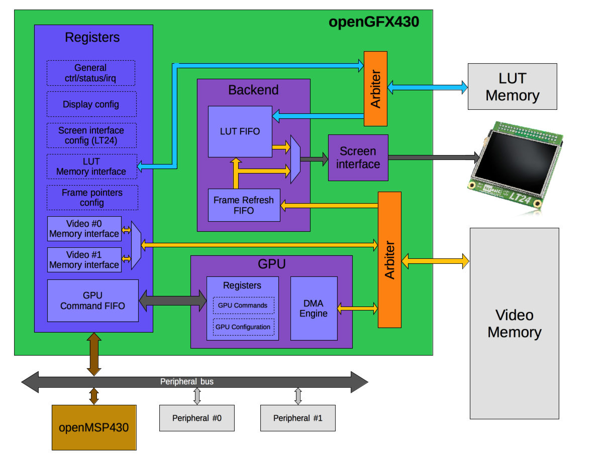

# Caravel User Project

  

| :exclamation: Important Note            |
|-----------------------------------------|

## Graphics Controller

### Description
The openGFX430 is a synthesizable Graphic controller written in Verilog and
tailored for the openMSP430 core.  

The openMSP430 is a synthesizable 16bit microcontroller core written in Verilog.
It is compatible with Texas Instruments' MSP430 microcontroller family and can 
execute the code generated by any MSP430 toolchain in a near cycle accurate way.

The core comes with some peripherals (16x16 Hardware Multiplier, Watchdog, GPIO,
TimerA, generic templates), with a DMA interface, and most notably with a two-wire
Serial Debug Interface supporting the MSPGCC GNU Debugger (GDB) for in-system
software debugging.

While being fully FPGA friendly, this design is also particularly suited for ASIC
implementations (typically mixed signal ICs with strong area and low-power requirements).
In a nutshell, the openMSP430 brings with it:

-   Low area (8k-Gates), without hidden extra infrastructure overhead (memory backbone, IRQ controller and watchdog timer are already included).
-   Excellent code density.
-   Good performances.
-   Build-in power and clock managment options.
-   Multiple times Silicon Proven.

### Features
Support following graphic modes:
-   16bpp
-   8bpp
-   4bpp
-   2bpp
-   1bpp
-   Smart address generation unit for fast indirect memory access.
-   GPU allowing hardware FILL, COPY and COPY_TRANSPARENT operations.
-   Supports the LT24 Terasic daughter card.
